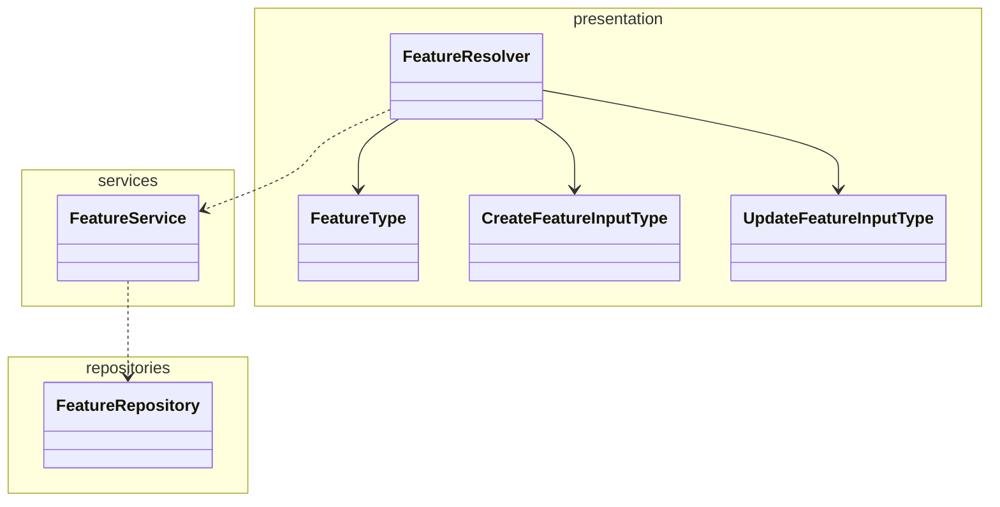

# Quacker Backend

A simplified version of proprietaryApplifting backend template for educational purposes.

## What's been set up for you

Compared to the bare bones Nest app you get when you create a new project, we also set this all up for you:

- **TypeScript Strict** mode
- **Prisma ORM**
- **Docker** and **Docker Compose** for local development (**Node.js** server and **Postgres** database)
- BetterAuth-based authentication - this should allow for easy extending with e.g. social login providers
- Example database entities (**Users**, **Quacks**, **Files**) with migrations
- Configured tests and resolve common issues with them in Nest (like proper path resolving)
- Decorator-based configuration with our `@applifting-io/nestjs-decorated-config` package
- GraphQL dataloaders with our `@applifting-io/nestjs-dataloader` package
- Real-time updates with GraphQL Subscriptions or Server-Sent Events
- File upload
- Unit tests

## Basic feature module architecture

Just a general example on how to structure a feature module, not a strict rule.



## Decisions explanation

- MariaDB running in Docker Compose for consistent development and production environments
- Prisma over TypeORM as it's newer, more type safe and offers a better developer experience overall
- Primarily code-first Apollo Graphql over Rest, same reasons as above
- BetterAuth library for authentication to provide battery-included solution for registering users, logging in, email verification etc. without having to re-invent the wheel

## Database Configuration

This project uses MariaDB running in Docker Compose for both development and production-like environments.

### Using MariaDB with Docker

1. Start the database and adminer:

```bash
pnpm backend docker:up
```

2. Access Adminer at http://localhost:8080

   - Server: db
   - Username: quackerUser
   - Password: quackerPassword
   - Database: quacker

## Running in Development

```bash
pnpm backend start:dev
```

## API Documentation

API documentation is available at http://localhost:4000/graphql when the server is running.

# Installation

First, make sure that you provided all the necessary env variables in .env file using .env.example as a template.

```bash
$ pnpm install
```

or

```bash
$ pnpm backend docker:up # this will also install and start the database, preferred
```

### Running the app

```bash
# watch mode (you will mostly need this)
$ pnpm backend start:dev

# production mode
$ pnpm backend start:prod

# locally with docker compose (run in repo root) - will only run database for you now, you still need to run the server manually using the previous commands
$ pnpm backend docker:up

# regenerate prisma schema and reseed data after changes
$ pnpm backend seed
```

### Prisma

All Prisma commands should be run from the root directory of the project using the `pnpm backend` prefix:

```bash
# generate Prisma client and seed DB
$ pnpm backend seed
# open Prisma Studio to view/edit data
$ pnpm backend prisma:studio
```

You actually do not need to manage migrations manually, the seed script by itself should be able to synchronize your database with the prisma schema.
This should be sufficient for the aim of this course (have a working application ready for presentation). Migrations are a topic you will have to deal with in the future if you're going to turn this into a real project.

### Test

There are currently any tests but there are still commands ready to run them if you want to add them later.

```bash
# unit tests
$ pnpm backend test

# test with coverage (will generate a coverage report HTML files in the coverage folder)
$ pnpm backend test:cov
```

### Better Auth

In this application, [**better-auth**](https://www.npmjs.com/package/better-auth) is utilized as the authentication module. It is designed to be easily extended with additional features or plugins, such as social login providers, multi-factor authentication, and more. Whenever database changes related to authentication are required, the following command should be run:

```bash
# propagate changes to the database schema (schema.prisma)
$ pnpm backend auth:generate
```

Hopefully you won't need to use this command and the following part, unless you want to change how the auth works/add more features to it (better ask us if you're trying to/need to for your project):

Keep in mind that there are 2 better auth configurations, one in the src/shared/auth/providers/better-auth.provider.ts (the complete config that is being used in the whole app) and one in the src/shared/auth/config/better-auth.config.ts (this config is being used by the CLI command above). You need to add the necessary changes to the better-auth config file to generate new database schema changes.

### GraphQL playground

After running locally, go to http://localhost:4000/graphql to test GraphQL Playground

### Compodoc

Visualize the code structure, modules, classes etc.

```bash
# serve documentation
$ pnpm backend docs:serve
```

### Prisma studio in Docker

If you want to run the app in docker, you can run prisma studio locally with the following command to access the data in docker:

```bash
# run in repo root
$ pnpm backend docker:prisma:studio
```

### Email Service

Emails are sent via [Resend](https://resend.com). Templates are authored as
React components using [react-email](https://react.email) and live in
`src/core/email/templates/`.

- `ResendAdapter` is used automatically when `RESEND_API_KEY` is set.
- If `RESEND_API_KEY` is empty (the default in `.env.example`), the
  `ConsoleMailerAdapter` logs emails to stdout — handy for local dev.
- The `from` address comes from `EMAIL_FROM`.

#### Authoring templates

Templates are plain `.tsx` React components receiving typed props. Use the
components from `@react-email/components` to keep markup email-client safe.

Preview templates locally with the bundled react-email dev server:

```bash
pnpm backend email:dev
```

To render a template to HTML at runtime, use the `renderEmail` helper in
`src/core/email/render.ts`:

```ts
const html = await renderEmail(VerifyEmail, { url });
await emailProvider.sendEmail(user.email, 'Verify your email address', html);
```
