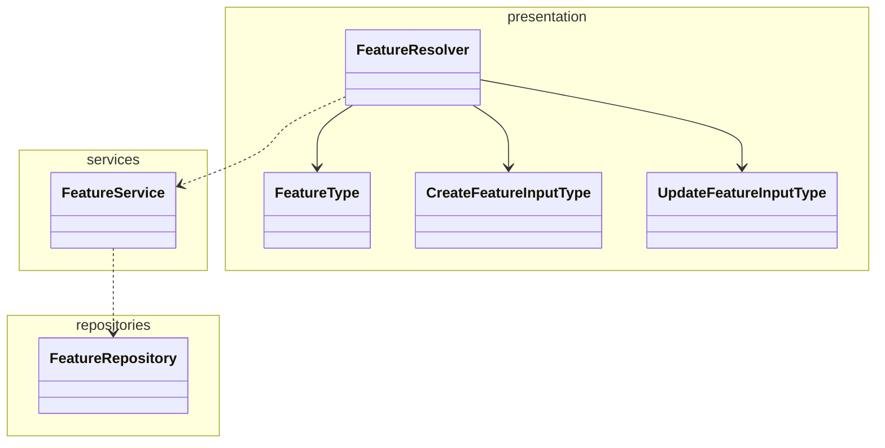

# Quacker Backend

A simplified version of proprietaryApplifting backend template for educational purposes.

## What's been set up for you

Compared to the bare bones Nest app you get when you create a new project, we also set this all up for you:

- **TypeScript Strict** mode
- **Prisma ORM**
- **Docker** and **Docker Compose** for local development (**Node.js** server and **Postgres** database)
- BetterAuth-based authentication - this should allow for easy extending with e.g. social login providers
- Example database entities (**Users**, **Quacks**, **Files**) with migrations
- Configured tests and resolve common issues with them in Nest (like proper path resolving)
- Decorator-based configuration with our `@applifting-io/nestjs-decorated-config` package
- GraphQL dataloaders with our `@applifting-io/nestjs-dataloader` package
- Real-time updates with GraphQL Subscriptions or Server-Sent Events
- File upload
- Unit tests

## Basic feature module architecture

Just a general example on how to structure a feature module, not a strict rule.



## Decisions explanation

- SQLite to be able to run the app locally without having to install any database (it is still possible to use it with postgres)
- Prisma over TypeORM as it's newer, more type safe and offers a better developer experience overall
- Primarily code-first Apollo Graphql over Rest, same reasons as above
- BetterAuth library for authentication to provide battery-included solution for registering users, logging in, email verification etc. without having to re-invent the wheel

# Installation

First, make sure that you provided all the necessary env variables in .env file using .env.example as a template.

```bash
$ npm install
```

or

```bash
$ npm run docker:up # this will also install and start the database, preferred
```

### Running the app

```bash
# development
$ npm run start

# watch mode
$ npm run start:dev

# production mode
$ npm run start:prod

# locally with docker compose (run in repo root)
$ npm run docker:up

# regenerate prisma schema after changes (run in repo root)
$ npm run docker:prisma:generate

# reinstall node module after changes (run in repo root)
$ npm run docker:up-rebuild
```

### Prisma

#### Locally

```bash
# generate and run migrations
$ npx prisma migrate dev --name [MigrationName]

# regenerate client after each schema change
$ npx prisma generate
```

#### With Docker Compose

```bash
# generate and run migrations (run in repo root)
$ npm run docker:migrations:generate [MigrationName]

# generate migrations (run in repo root)
$ npm run docker:migrations:run [MigrationName]

# re-generate client (run in repo root)
$ npm run docker:prisma:generate
```

### Seed

```bash
# seed database with example data
$ npm run seed

# with docker (run in repo root)
$ npm run docker:seed
```

### Test

Integration tests creates clean database on startup so the tests are run on clean independent database. After the tests are done, the database is dropped.

```bash
# unit tests
$ npm run test

# e2e tests
$ npm run test:e2e

# integration tests
$ npm run test:integration

# test coverage
$ npm run test:cov
```

### Better Auth

In this application, [**better-auth**](https://www.npmjs.com/package/better-auth) is utilized as the authentication module. It is designed to be easily extended with additional features or plugins, such as social login providers, multi-factor authentication, and more. Whenever database changes related to authentication are required, the following command should be run:

```bash
# propagate changes to the database schema (schema.prisma)
$ npm run auth:generate
```

### GraphQL playground

After running locally, go to http://localhost:4000/graphql to test GraphQL Playground

### Compodoc

Visualize the code structure, modules, classes etc.

```bash
# serve documentation
$ npm run docs:serve
```

### Prisma studio

When the app is running in docker, you can run prisma studio locally with the following command to access the data in docker:

```bash
# run in repo root
$ npm run docker:prisma:studio
```

### Dropping/creating DB

Sometimes you might need to do it manually. When the app is running in docker:

```bash
$ docker-compose exec postgres createdb -U postgres quacker_local
$ docker-compose exec postgres dropdb -U postgres quacker_local
```
