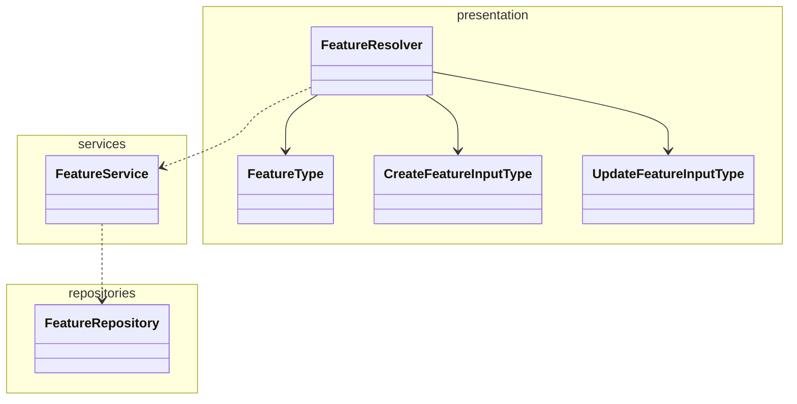

# Quacker Backend

A simplified version of proprietaryApplifting backend template for educational purposes.

## What's been set up for you

Compared to the bare bones Nest app you get when you create a new project, we also set this all up for you:

- **TypeScript Strict** mode
- **Prisma ORM**
- **Docker** and **Docker Compose** for local development (**Node.js** server and **Postgres** database)
- BetterAuth-based authentication - this should allow for easy extending with e.g. social login providers
- Example database entities (**Users**, **Quacks**, **Files**) with migrations
- Configured tests and resolve common issues with them in Nest (like proper path resolving)
- Decorator-based configuration with our `@applifting-io/nestjs-decorated-config` package
- GraphQL dataloaders with our `@applifting-io/nestjs-dataloader` package
- Real-time updates with GraphQL Subscriptions or Server-Sent Events
- File upload
- Unit tests

## Basic feature module architecture

Just a general example on how to structure a feature module, not a strict rule.



## Decisions explanation

- MariaDB running in Docker Compose for consistent development and production environments
- Prisma over TypeORM as it's newer, more type safe and offers a better developer experience overall
- Primarily code-first Apollo Graphql over Rest, same reasons as above
- BetterAuth library for authentication to provide battery-included solution for registering users, logging in, email verification etc. without having to re-invent the wheel

## Database Configuration

This project uses MariaDB running in Docker Compose for both development and production-like environments.

### Using MariaDB with Docker

1. Start the database and adminer:

   ```bash
   yarn backend docker:up
   ```

2. Access Adminer at http://localhost:8080

   - Server: db
   - Username: quackerUser
   - Password: quackerPassword
   - Database: quacker

3. Start the MariaDB:
   ```bash
   yarn backend docker:up
   ```

### Database Reset

To reset your database:

```bash
yarn backend db:reset
```

## Running in Development

```bash
yarn backend start:dev
```

## API Documentation

API documentation is available at http://localhost:4000/graphql when the server is running.

# Installation

First, make sure that you provided all the necessary env variables in .env file using .env.example as a template.

```bash
$ yarn install
```

or

```bash
$ yarn backend docker:up # this will also install and start the database, preferred
```

### Running the app

```bash
# development
$ yarn backend start

# watch mode
$ yarn backend start:dev

# production mode
$ yarn backend start:prod

# locally with docker compose (run in repo root)
$ yarn backend docker:up

# regenerate prisma schema after changes
$ yarn backend prisma:generate
```

### Prisma

All Prisma commands should be run from the root directory of the project using the `yarn backend` prefix:

```bash
# generate Prisma client
$ yarn backend prisma:generate

# create a new migration
$ yarn backend prisma:migrations:generate [MigrationName]

# run migrations
$ yarn backend prisma:migrations:run

# open Prisma Studio to view/edit data
$ yarn backend prisma:studio
```

### Seed

```bash
# seed database with example data
$ yarn backend seed
```

### Test

Integration tests creates clean database on startup so the tests are run on clean independent database. After the tests are done, the database is dropped.

```bash
# unit tests
$ yarn backend test

# e2e tests
$ yarn backend test:e2e

# integration tests
$ yarn backend test:integration

# test coverage
$ yarn backend test:cov
```

### Better Auth

In this application, [**better-auth**](https://www.npmjs.com/package/better-auth) is utilized as the authentication module. It is designed to be easily extended with additional features or plugins, such as social login providers, multi-factor authentication, and more. Whenever database changes related to authentication are required, the following command should be run:

```bash
# propagate changes to the database schema (schema.prisma)
$ yarn backend auth:generate
```

### GraphQL playground

After running locally, go to http://localhost:4000/graphql to test GraphQL Playground

### Compodoc

Visualize the code structure, modules, classes etc.

```bash
# serve documentation
$ yarn backend docs:serve
```

### Prisma studio

When the app is running in docker, you can run prisma studio locally with the following command to access the data in docker:

```bash
# run in repo root
$ yarn backend docker:prisma:studio
```

### Dropping/creating DB

Sometimes you might need to do it manually. When the app is running in docker:

```bash
$ docker-compose exec postgres createdb -U postgres quacker_local
$ docker-compose exec postgres dropdb -U postgres quacker_local
```
